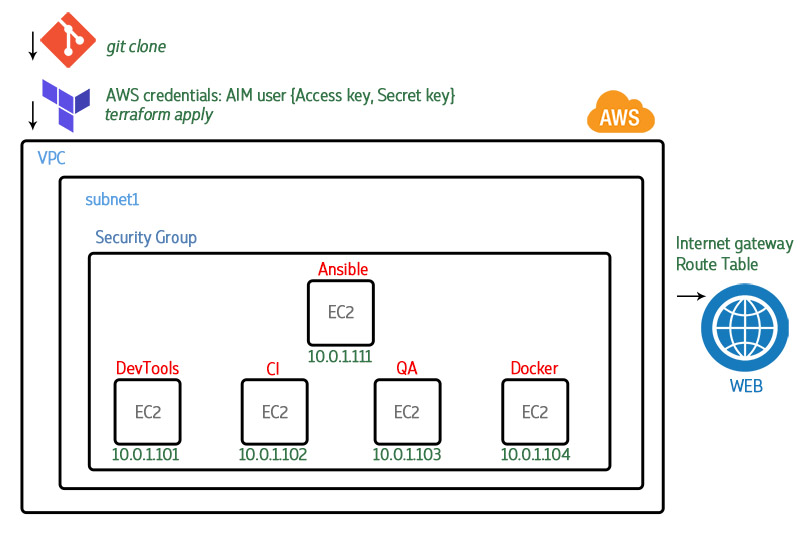

# Create AWS infrastructure with Terraform

This Terraform code deploys AWS infrastructure for GraduationWork project. 



All the parameters listed in variables.tf file.

To connect to Your AWS Account You must add terraform.tfvars file that includes Your credentials secrets:

```sh 
access_key = "********************"
secret_key = "****************************************"
```

# Howto get AWS credentials to authorize Terraform manifests:

- Login to your AWS account. 
- Go to Identity and Access Management (IAM) - Users. 
- Create user with administrator accsess. 
- For that user go to Security credential tab and create new Accsess key. 
- Copy **access_key** and **secret_key** to ***terraform.tfvars*** file.

## Terraform. Create AWS infrastructure

Clone the repository [tf](https://github.com/aurcame/tf):

```sh 
git clone https://github.com/aurcame/tf.git
cd tf
terraform init
```

Run the terraform plan command to create the Terraform plan which defines all the infrastructure elements

```sh
terraform plan
```
Check and if everything is fine, then

Apply terraform manifests:

```sh
terraform apply
```

#### Done. 
Check all the resources created for your environment.
